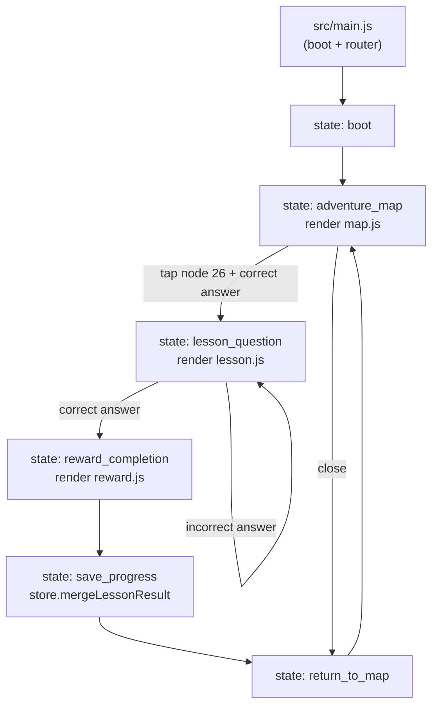
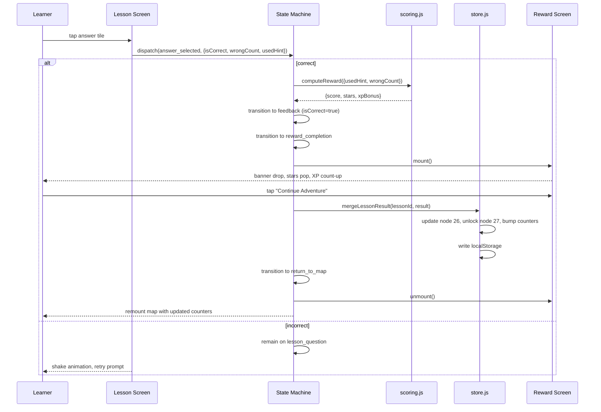

# Design Document — MathQuest: Star Trail Vertical MVP Slice

---

**Purpose**: Provide sufficient detail to ensure implementation consistency across different implementers, preventing interpretation drift.

**Approach**:
- Include essential sections that directly inform implementation decisions
- Omit optional sections unless critical to preventing implementation errors
- Match detail level to feature complexity
- Use diagrams and tables over lengthy prose

**Warning**: Approaching 1000 lines indicates excessive feature complexity that may require design simplification.

---

> Sections may be reordered (e.g., surfacing Requirements Traceability earlier or moving Data Models nearer Architecture) when it improves clarity. Within each section, keep the flow **Summary → Scope → Decisions → Impacts/Risks** so reviewers can scan consistently.

## Overview

**Purpose**: This slice delivers the first playable vertical loop of MathQuest: Star Trail — a polished mobile math adventure for children — so that the product can be demoed, validated against acceptance criteria, and used as the foundation for future content slices.

**Users**: Primary users are children (ages 8–11) working through Cambridge Primary Mathematics Stage 3–4 place-value content. Secondary users are teachers and parents reviewing the experience in a desktop browser preview.

### Known Limitations (Client-Only MVP)
This slice ships as a static client-side web app with `localStorage` as the only persistence. The following risks are accepted as out of scope for this slice:
- **Progress tampering**: a learner (or any user with DevTools) can edit `mathquest:v1:state` in `localStorage` to award themselves unlimited stars/XP and unlock all nodes. The slice does not implement signed event logs, server-side validation, or any other tamper resistance. Future slices that add account sync or server-side scoring will address this.
- **Author content injection**: lesson and reward text is hard-coded from `LESSON` in `src/state/config.js`. All dynamic strings are rendered via `textContent` (never `innerHTML`). If a future slice adds a CMS or content import pipeline, it MUST sanitize author-supplied strings before rendering.
- **Cross-tab consistency**: opening the app in two tabs can lead to one tab overwriting the other's progress. The slice does not implement `storage` event listeners or cross-tab locking.
- **No CSP meta tag at this time**: a strict CSP will be added in a future slice that introduces author content or third-party scripts beyond the GSAP CDN. The current slice has no `innerHTML` sinks.

**Impact**: This is a greenfield build. There is no existing application code, so every file is new. The slice persists learner progress to `localStorage` so a child can close the tab and resume; future slices can build on the same persistence contract.

### Goals
- Render 3 screens (Adventure Map, Lesson / Question, Reward / Completion) using the approved polished art package, with overlays and animations that match the JSON guidance.
- Implement a 9-state state machine that drives the loop deterministically and exposes clean transitions for side effects.
- Compute and persist rewards with the 4-tier scoring rule from the config.
- Respect `prefers-reduced-motion` with a single re-evaluation point and a uniform fallback.
- Ship as zero-build static files: open `index.html` over a static server and the game runs.

### Non-Goals
- Audio, TTS, sound effects, haptics.
- Multi-question lesson sessions, lesson sequencing, retry-with-different-questions.
- Real backend, account creation, cloud sync, leaderboards.
- Shop, Quests, or Practice screen content; the three nav items are visual placeholders.
- i18n, settings screen, account management, telemetry, analytics.
- Test framework setup; manual walkthrough is the verification surface for this slice.
- Lottie / spine fox animations; the fox mascot is a static PNG overlay.

## Architecture

> Reference detailed discovery notes in `research.md` only for background; keep design.md self-contained for reviewers by capturing all decisions and contracts here.
> Capture key decisions in text and let diagrams carry structural detail—avoid repeating the same information in prose.

### Existing Architecture Analysis (if applicable)
- There is no existing application code. The only contracts in the repo are the JSON guidance files in `json/` and the source-of-truth markdown at the project root. These are the binding specification; the implementation must consume them verbatim via `src/state/config.js`.

### Architecture Pattern & Boundary Map

**Architecture Integration**:
- Selected pattern: **Screen-as-function** with a central state machine. Each screen module exports `render(root, state, dispatch) → unmount()`. The App Shell calls `unmount()` before mounting the next screen, killing GSAP timelines and clearing DOM.
- Domain/feature boundaries:
  - `src/state/` — pure logic: state machine, scoring, store, config. No DOM access.
  - `src/motion/` — GSAP timeline factories with reduced-motion fallback. No state mutation.
  - `src/screens/` — DOM rendering, event wiring, calls into `src/state` and `src/motion`.
  - `src/components/` — reusable DOM helpers (counter pill, heart row, progress bar).
  - `src/util/` — generic helpers (`h(tag, props, children)`).
- Existing patterns preserved: None — greenfield.
- New components rationale: each component exists because it is rendered on at least one screen and reused in the verification walkthrough.
- Steering compliance: YAGNI (vanilla stack, no test framework), KISS (no router, no global store), DRY (counters, hearts, progress bar extracted to components).

> **State machine simplification (Red Team 2026-06-15)**: The slice uses 6 active states. The original 9-state enumeration in `mathquest_mvp_implementation_config.json` listed `node_26_selected`, `answer_selected`, and `feedback` as intermediate states. These three states are recorded in `design.md` as a transition log for future slices, but the runtime state machine implements only the 6 states that have a render or a side effect. This keeps each state a load-bearing contract; states without a render or side effect are YAGNI.

**Documented transition log (informational, not runtime states)**:
- `node_26_selected` — informational only. The tap event on node 26 dispatches `NODE_26_SELECTED` for analytics hooks; the runtime immediately transitions to `lesson_question`.
- `answer_selected` — informational only. The tile click event is dispatched; the runtime immediately transitions to `reward_completion` (correct) or stays on `lesson_question` (incorrect).
- `feedback` — informational only. The 600ms green-glow animation is rendered inline on the answer tile by `motion/shake.js`; no separate state is needed.



### Technology Stack

| Layer | Choice / Version | Role in Feature | Notes |
|-------|------------------|-----------------|-------|
| Frontend / CLI | Vanilla HTML + ES Modules | Single `index.html` entry, ES module files under `src/` | Zero build step. |
| Animation | GSAP 3.12.5 via import map (`https://cdn.jsdelivr.net/npm/gsap@3.12.5/+esm`) | Map pulse, reward enter, correct/incorrect feedback | Falls back to `gsap.set` under reduced motion. |
| Styling | Plain CSS in `src/styles/{tokens,main,motion}.css` | Tokens, base layout, reduced-motion overrides | No Tailwind, no PostCSS. |
| State | Plain JS modules: `machine.js`, `scoring.js`, `store.js`, `config.js` | State transitions, scoring, persistence | Pure functions where possible. |
| Persistence | `localStorage` | Save / load learner progress | Versioned key `mathquest:v1:state`. |
| Runtime | Any evergreen browser (Chrome 89+, Safari 14+, Firefox 108+) | ES modules + import maps | Tested target: iOS Safari and Chrome Android via desktop DevTools emulator. |

## Canonical Contracts & Invariants

| Contract Area | Canonical Decision | Applies To | Must Stay Consistent In |
|---------------|--------------------|------------|-------------------------|
| Auth / session | None. | n/a | Out of scope. |
| Transport / entrypoints | Single entry: `index.html` mounts `#app` and runs `src/main.js`. No router. | App Shell | `index.html`, `src/main.js` |
| Data / persistence | Key `mathquest:v1:state`. Shape `{schemaVersion: 1, savedAt, learner {level, stars, streak, xp, activeNodeId}, nodes[7], currentWorld}`. Writes are atomic (`JSON.stringify` then `setItem`). Reads validate `schemaVersion === 1` AND every field's type and the `nodes[7]` length; fallback to `DEFAULT_STATE` on mismatch. `save()` returns `{ ok, error? }`; the App Shell does NOT update in-memory state if `save()` returns `{ ok: false }`. | `src/state/store.js` | R0-01, R4-01 |
| Deletion / retention policy | No delete path in this slice. Future slices may add a "reset progress" button. | n/a | Out of scope. |
| Generated artifacts / runtime outputs | GSAP timelines returned as `{ play, kill, isReduced }`. Each screen returns `{ unmount }`. DOM uses `data-reduced-motion` attribute on `#app` root; the attribute is set on every `mountScreen` call (not just boot). Lesson session `{ usedHint, wrongCount }` travels in the `CORRECT` dispatch payload from `lesson.js`; no global state in `main.js`. | `src/motion/*`, `src/screens/*`, `src/main.js` | R0-01, R1-01, R1-02, R2-01, R2-02, R2-03, R3-01, R4-01, R4-02 |

> Task files must reuse the same contract wording. If implementation later needs a different contract, update this section first before generating or editing tasks.

## System Flows

The state machine is the single source of loop truth. The Mermaid diagram above shows the 9 states. Below is the data flow for the lesson-to-reward transition (the most complex path).



Flow decisions:
- Scoring is computed on `answer_selected` (correct path only) so the Reward Screen can read the result synchronously when it mounts.
- `mergeLessonResult` is the only place that writes to `localStorage` for lesson completion, keeping the persistence surface small and testable.
- `unmount()` is called before the next screen mounts to kill active GSAP timelines and clear DOM event listeners.

## Requirements Traceability

Map each requirement ID to the design elements that realize it.

| Requirement | Summary | Components | Interfaces | Flows |
|-------------|---------|------------|------------|-------|
| 1.1 | Boot reads localStorage within 50ms | `store.js::load` | `localStorage.getItem` | boot → adventure_map |
| 1.2 | Fallback to `initial_learner_state` on missing/corrupt | `store.js::load`, `config.js::DEFAULT_STATE` | n/a | boot |
| 1.3 | Transition to `adventure_map` on boot success | `machine.js::transition`, `main.js::boot` | `onTransition` hook | boot |
| 2.1 | Map renders 01_adventure_map_screen.png | `screens/map.js` | n/a | map |
| 2.2 | Top counter pills Level/Stars/Streak | `components/counter.js` | n/a | map |
| 2.3 | World banner "Star Trail" | `screens/map.js` | n/a | map |
| 2.4 | Bottom nav strip | `screens/map.js` | n/a | map |
| 3.1 | Render map_node_current_26.png on node 26 | `components/node.js` | n/a | map |
| 3.2 | Node 26 pulse 1.6s yoyo | `motion/pulse.js` | GSAP timeline | map |
| 3.3 | Tap node 26 → scale-up + transition | `screens/map.js`, `machine.js` | GSAP timeline + state dispatch | map → node_26_selected |
| 3.4 | Node 26 keyboard accessible | `components/node.js` | `tabindex=0`, `role=button` | map |
| 4.1 | Lesson renders 02_lesson_question_screen.png | `screens/lesson.js` | n/a | lesson |
| 4.2 | Progress bar 4/10 | `components/progress.js` | n/a | lesson |
| 4.3 | 2 filled + 1 empty hearts | `components/hearts.js` | n/a | lesson |
| 4.4 | Close button, keyboard accessible | `screens/lesson.js` | `aria-label` | lesson |
| 5.1 | Question text "Which number is 400 + 30 + 6?" | `screens/lesson.js` | n/a | lesson |
| 5.2 | 4 answer tiles, 88×88 min | `screens/lesson.js` | `role=button`, `aria-label` | lesson |
| 5.3 | Correct tap → green glow + transition | `screens/lesson.js`, `motion/shake.js` (positive variant) | GSAP timeline | lesson → feedback |
| 5.4 | Wrong tap → shake, stay on lesson | `screens/lesson.js`, `motion/shake.js` | GSAP timeline | lesson |
| 5.5 | Increment wrongCount, clear shake | `screens/lesson.js` | state | lesson |
| 6.1 | Hint/Help/Read buttons anchored bottom | `screens/lesson.js` | n/a | lesson |
| 6.2 | Hint → tooltip + usedHint flag | `screens/lesson.js` | state | lesson |
| 6.3 | Help → worked-example block | `screens/lesson.js` | n/a | lesson |
| 6.4 | Read → visual highlight sweep | `screens/lesson.js` | DOM class toggle | lesson |
| 6.5 | Hint/Help/Read keyboard accessible | `screens/lesson.js` | `aria-label` | lesson |
| 7.1 | Reward renders 03_reward_completion_screen.png | `screens/reward.js` | n/a | reward |
| 7.2 | Banner drop 500ms back.out | `screens/reward.js`, `motion/reward-pop.js` | GSAP timeline | reward |
| 7.3 | 3 stars pop, 200ms stagger | `screens/reward.js`, `motion/reward-pop.js` | GSAP timeline | reward |
| 7.4 | XP badge count-up 0→60, 1s | `screens/reward.js`, `motion/reward-pop.js` | GSAP timeline | reward |
| 7.5 | Continue Adventure + Back to Map CTAs | `screens/reward.js` | n/a | reward |
| 8.1 | Scoring on feedback (isCorrect=true) | `state/scoring.js` | `computeReward` | lesson → reward |
| 8.2–8.5 | 4-tier scoring rule | `state/scoring.js` | pure function | reward |
| 8.6 | +60 XP completion bonus | `state/scoring.js`, `state/store.js` | n/a | reward → save |
| 9.1 | Write to localStorage on save_progress | `state/store.js::save` | `localStorage.setItem` | save |
| 9.2 | Persisted snapshot shape v1 | `state/store.js`, `state/config.js::DEFAULT_STATE` | JSON | save |
| 9.3 | Update node 26 state, stars, score, attempts | `state/store.js::mergeLessonResult` | n/a | save |
| 9.4 | Add stars + XP to learner | `state/store.js::mergeLessonResult` | n/a | save |
| 9.5 | Streak++ if wrongCount ≤ 1 | `state/store.js::mergeLessonResult` | n/a | save |
| 9.6 | try/catch on setItem | `state/store.js::save` | n/a | save |
| 10.1 | Continue Adventure → return_to_map | `screens/reward.js`, `state/machine.js` | state dispatch | reward → map |
| 10.2 | Unlock node 27 on completion | `state/store.js::mergeLessonResult` | n/a | save |
| 10.3 | Unmount reward, remount map with updated state | `src/main.js` | `unmount()` | return_to_map |
| 10.4 | No pulse on completed node 26 | `screens/map.js` | state read | map |
| 10.5 | Node 27 visible, non-locked | `screens/map.js` | state read | map |
| 11.1 | Re-query matchMedia on every mount | `motion/reduced.js` | n/a | all screens |
| 11.2 | Node 26 static gold border under reduced motion | `screens/map.js` | CSS | map |
| 11.3 | Banner/stars/XP replaced with opacity + immediate XP | `motion/reward-pop.js` | reduced branch | reward |
| 11.4 | Shake replaced with red tint + retry prompt | `motion/shake.js` | reduced branch | lesson |
| 12.1 | First interactive frame < 1s | preload map background, defer GSAP | n/a | boot |
| 12.2 | Store never throws | `state/store.js` | try/catch | save/load |
| 12.3 | Kill GSAP timelines on screen change | `src/main.js::mount` | `gsap.killTweensOf` | all screens |
| 13.1 | Keyboard tab order | `src/main.js` | `tabindex` | all screens |
| 13.2 | Answer tiles have `role=button`, `aria-label` | `screens/lesson.js` | DOM attributes | lesson |
| 13.3 | `data-reduced-motion` on root | `src/main.js` | DOM attribute | all screens |
| 14.1–14.4 | Art direction conformance | `src/screens/*.js` | asset paths | all screens |
| 14.5 | No text/watermark not in art package | all | manual review | all screens |

## Components and Interfaces

| Component | Domain/Layer | Intent | Req Coverage | Key Dependencies (P0/P1) | Contracts |
|-----------|--------------|--------|--------------|--------------------------|-----------|
| `App` (`src/main.js`) | Bootstrap | Boot, route, mount/unmount screens; single `appState` object holding `currentUnmount` and `currentState`; lesson session travels in dispatch payload (no global state) | 1.1–1.3, 10.1–10.3, 12.1, 12.2, 12.3, 13.1, 13.3 | `state/store.js`, `state/machine.js`, `motion/reduced.js` | State, Service |
| `MapScreen` (`src/screens/map.js`) | UI | Adventure Map render + node tap | 2.1–2.4, 3.1–3.4, 10.4–10.5, 14.1–14.5 | `components/counter.js`, `components/node.js`, `motion/pulse.js` | UI |
| `LessonScreen` (`src/screens/lesson.js`) | UI | Lesson frame + question + answer + Hint/Help/Read; owns session `{ usedHint, wrongCount, busy }` in closure; propagates session in `CORRECT` dispatch payload | 4.1–4.4, 5.1–5.5, 6.1–6.5, 14.1–14.5 | `components/progress.js`, `components/hearts.js`, `motion/shake.js` | UI |
| `RewardScreen` (`src/screens/reward.js`) | UI | Reward render + animation + CTAs; receives reward payload from App Shell (no internal scoring) | 7.1–7.5, 14.1–14.5 | `motion/reward-pop.js` | UI |
| `StateMachine` (`src/state/machine.js`) | Logic | 6-state machine (`boot`, `adventure_map`, `lesson_question`, `reward_completion`, `save_progress`, `return_to_map`) with intermediate `EVENTS` constants for tap-driven transitions | 1.3, 10.1 | none | Service |
| `Scoring` (`src/state/scoring.js`) | Logic | Lookup-table 4-tier reward by `wrongCount`, with `usedHint` downgrading the top tier only | 8.1–8.6 | none | Service (pure) |
| `Store` (`src/state/store.js`) | Persistence | localStorage v1 with strict shape validation, `save()` returns `{ ok, error? }`, `mergeLessonResult(state, result)` is pure (no internal `load()`) | 9.1–9.6, 10.2, 12.2 | `state/config.js` | Service |
| `Config` (`src/state/config.js`) | Data | Inlined JSON guidance | all data-driven | none | Data |
| `ReducedMotion` (`src/motion/reduced.js`) | Capability | `matchMedia` wrapper; re-queries on every call | 11.1, 13.3 | none | Service (pure) |
| `Pulse` (`src/motion/pulse.js`) | Motion | Node 26 pulse timeline factory; `kill()` re-applies green ring for completed nodes | 3.2, 11.2 | GSAP, `motion/reduced.js` | Service |
| `Shake` (`src/motion/shake.js`) | Motion | Correct/incorrect feedback; reduced branch uses static tint + `setTimeout(200)` to clear `busy` | 5.3, 5.4, 11.4 | GSAP, `motion/reduced.js` | Service |
| `RewardPop` (`src/motion/reward-pop.js`) | Motion | Banner + stars + XP; `kill()` snaps `xpEl.textContent = String(targetXp)` before returning | 7.2–7.4, 11.3 | GSAP, `motion/reduced.js` | Service |
| `Counter` (`src/components/counter.js`) | UI | Pill counter | 2.2 | none | UI |
| `Node` (`src/components/node.js`) | UI | Map node DOM + tap + (optional) pulse, decided by `state === 'active'` | 3.1–3.4 | `motion/pulse.js` | UI |
| `Hearts` (`src/components/hearts.js`) | UI | Hearts row | 4.3 | none | UI |
| `Progress` (`src/components/progress.js`) | UI | 4/10 progress bar | 4.2 | none | UI |

### Bootstrap

#### App (`src/main.js`)

| Field | Detail |
|-------|--------|
| Intent | Boot the app, load persisted state, mount the first screen, route transitions. |
| Requirements | 1.1, 1.2, 1.3, 10.1, 10.2, 10.3, 12.1, 12.3, 13.1, 13.3 |

**Responsibilities & Constraints**
- Primary responsibility: read persisted state, mount the initial screen, route transitions.
- Domain boundary: this is the only module that calls `screen.render()` and `screen.unmount()`. Screens never call each other.
- Data ownership: does not own any state; reads from `Store.load()` and `Machine.transition()`.

**Dependencies**
- Inbound: browser boot — index.html `DOMContentLoaded`.
- Outbound: `Store` (P0), `Machine` (P0), `ReducedMotion` (P0), all three screen modules (P0).

**Contracts**: State [x] / API [ ] / Event [ ] / Batch [ ] / Service [x]

##### Service Interface
```js
// src/main.js — single appState object; no other module-level mutable state.
import { load as loadState, save, mergeLessonResult } from './state/store.js';
import { dispatch as machineDispatch, STATES, EVENTS } from './state/machine.js';
import { setRootDataAttribute } from './motion/reduced.js';
import { render as renderMap } from './screens/map.js';
import { render as renderLesson } from './screens/lesson.js';
import { render as renderReward } from './screens/reward.js';

const appState = { currentUnmount: null, currentState: null };

export function boot(root) {
  setRootDataAttribute(root);
  appState.currentState = loadState();
  machineDispatch(STATES.BOOT, 'INIT', null);
  mountScreen('adventure_map');
}

export function mountScreen(name, payload) {
  setRootDataAttribute(/* root */); // re-evaluated on every mount
  if (appState.currentUnmount) { appState.currentUnmount(); appState.currentUnmount = null; }
  if (name === 'adventure_map') {
    appState.currentUnmount = renderMap(root, appState.currentState, dispatch).unmount;
  } else if (name === 'lesson_question') {
    appState.currentUnmount = renderLesson(root, appState.currentState, dispatch).unmount;
  } else if (name === 'reward_completion') {
    appState.currentUnmount = renderReward(root, appState.currentState, dispatch, payload).unmount;
  }
}

// dispatch(event, payload) — the App Shell's only event handler.
// On CORRECT, payload.session = { usedHint, wrongCount } from the lesson screen.
// On CONTINUE, the App Shell calls mergeLessonResult(currentState, payload) and
// conditionally updates appState.currentState only if persisted.ok === true.
export function dispatch(event, payload) { /* ... */ }
```

- Preconditions: `#app` element exists in DOM.
- Postconditions: Adventure Map is mounted and visible.
- Invariants: only one screen is mounted at any time; the lesson session never lives in `main.js`; `appState.currentState` is only updated after a successful `save()`.

### State Layer

#### StateMachine (`src/state/machine.js`)

| Field | Detail |
|-------|--------|
| Intent | Enforce valid transitions between 9 states. |
| Requirements | 1.3, 10.1 |

**Responsibilities & Constraints**
- Pure: given a `currentState` and an `event`, returns a `nextState` or throws on invalid transition.
- Exposes a `dispatch(event, payload)` convenience that calls `transition` and runs the `onTransition` hook.

**Contracts**: Service [x]

##### Service Interface
```js
// src/state/machine.js — 6 active runtime states
export const STATES = Object.freeze({
  BOOT: 'boot',
  ADVENTURE_MAP: 'adventure_map',
  LESSON_QUESTION: 'lesson_question',
  REWARD_COMPLETION: 'reward_completion',
  SAVE_PROGRESS: 'save_progress',
  RETURN_TO_MAP: 'return_to_map',
});

// Documented intermediate events (informational — not runtime states).
// These are event names that the runtime dispatches, but the state machine
// transitions immediately to the next active state.
export const EVENTS = Object.freeze({
  NODE_26_SELECTED: 'NODE_26_SELECTED', // dispatched on tap; transition ADVENTURE_MAP -> LESSON_QUESTION
  CORRECT: 'CORRECT',                   // correct answer tap; transition LESSON_QUESTION -> REWARD_COMPLETION
  INCORRECT: 'INCORRECT',               // wrong answer tap; stay on LESSON_QUESTION
  CLOSE: 'CLOSE',                       // lesson close; transition LESSON_QUESTION -> RETURN_TO_MAP
  CONTINUE: 'CONTINUE',                 // reward CTA; transition REWARD_COMPLETION -> SAVE_PROGRESS
  BACK_TO_MAP: 'BACK_TO_MAP',           // reward secondary; transition REWARD_COMPLETION -> RETURN_TO_MAP (no save)
  DONE: 'DONE',                         // save complete; transition SAVE_PROGRESS -> RETURN_TO_MAP
});

export function transition(currentState, event) { /* throws on invalid */ }
export function dispatch(currentState, event, payload) { /* transition + hook */ }
```

**Scoring truth table** (Red Team 2026-06-15 — to disambiguate the `usedHint + wrongCount` overlap):

| `wrongCount` | `usedHint` | `score` | `stars` | `xpBonus` |
|---|---|---|---|---|
| 0 | false | 10 | 3 | 60 |
| 0 | true  | 7  | 2 | 60 |
| 1 | false | 5  | 2 | 60 |
| 1 | true  | 5  | 2 | 60 |
| ≥2 | false | 3  | 1 | 60 |
| ≥2 | true  | 3  | 1 | 60 |

The implementation is a single lookup by `wrongCount` (the dominant axis). `usedHint` only affects the top tier (first-try correct). All `xpBonus` is 60 (completion bonus, always granted on `CORRECT`).

#### Scoring (`src/state/scoring.js`)

| Field | Detail |
|-------|--------|
| Intent | Pure function mapping `{usedHint, wrongCount}` to `{score, stars, xpBonus}`. |
| Requirements | 8.1, 8.2, 8.3, 8.4, 8.5, 8.6 |

**Contracts**: Service [x] (pure, no side effects)

##### Service Interface
```js
// src/state/scoring.js — lookup-table implementation
const TIERS = [
  { max: 0, score: 10, stars: 3 }, // wrongCount === 0
  { max: 1, score: 5,  stars: 2 }, // wrongCount === 1
  { max: Infinity, score: 3, stars: 1 }, // wrongCount >= 2
];
export function computeReward({ usedHint, wrongCount }) {
  const hint = Boolean(usedHint);
  const wrong = Math.max(0, Number(wrongCount) || 0);
  const tier = TIERS.find((t) => wrong <= t.max);
  let { score, stars } = tier;
  // usedHint only downgrades the top tier (first-try correct).
  if (hint && wrong === 0) { score = 7; stars = 2; }
  return { score, stars, xpBonus: 60 };
}
```

#### Store (`src/state/store.js`)

| Field | Detail |
|-------|--------|
| Intent | Persist and load learner progress from `localStorage` under `mathquest:v1:state`. |
| Requirements | 9.1, 9.2, 9.3, 9.4, 9.5, 9.6, 10.2, 12.2 |

**Contracts**: Service [x]

##### Service Interface
```js
// src/state/store.js
export const STORAGE_KEY = 'mathquest:v1:state';
export function load() {
  // returns DEFAULT_STATE on missing/corrupt; strict shape validation
  // (typeof check on every field; nodes.length === 7).
}
export function save(state) {
  // returns { ok: true } on success or { ok: false, error: string } on failure.
  // Never throws. Caller MUST check `ok` before updating in-memory state.
}
export function mergeLessonResult(state, result) {
  // Pure: takes the current state explicitly (no internal load() call).
  // Updates the active node to 'completed' with stars = max(prev, awarded).
  // Unlocks the next 'locked' node by setting its state to 'available'.
  // Bumps learner counters and streak.
  // Returns { nextState, persisted: { ok, error? } }.
  // persisted.ok === false means in-memory nextState is NOT updated by caller.
}
```

### Motion Layer

#### Pulse (`src/motion/pulse.js`)
**Requirements**: 3.2, 11.2
**Service Interface**:
```js
export function createPulseTimeline(nodeEl) {
  // returns { play(), kill(), isReduced: boolean }
  // under reduced motion: sets 2px gold border, no animation
}
```

#### Shake (`src/motion/shake.js`)
**Requirements**: 5.3, 5.4, 11.4
**Service Interface**:
```js
export function createShakeTimeline(tileEl, { isCorrect }) {
  // correct: green boxShadow 0->24px
  // incorrect: x: 0->-8->8->-6->6->0
  // reduced: opacity 0->1 + border tint
  // returns { play(), kill(), isReduced: boolean }
}
```

#### RewardPop (`src/motion/reward-pop.js`)
**Requirements**: 7.2, 7.3, 7.4, 11.3
**Service Interface**:
```js
export function createRewardTimeline({ bannerEl, starEls, xpEl, targetXp }) {
  // returns { play(), kill(), isReduced: boolean }
}
```

#### ReducedMotion (`src/motion/reduced.js`)
**Requirements**: 11.1, 13.3
**Service Interface**:
```js
export function isReducedMotion() { /* re-queries matchMedia each call */ }
export function setRootDataAttribute(rootEl) { /* sets data-reduced-motion on #app */ }
```

### Screen Layer

#### MapScreen (`src/screens/map.js`)
**Requirements**: 2.1–2.4, 3.1–3.4, 10.4, 10.5, 14.1, 14.2, 14.5
**Service Interface**:
```js
export function render(rootEl, state, dispatch) {
  // returns { unmount() }
}
```

#### LessonScreen (`src/screens/lesson.js`)
**Requirements**: 4.1–4.4, 5.1–5.5, 6.1–6.5, 14.3, 14.5
**Service Interface**:
```js
export function render(rootEl, state, dispatch) {
  // returns { unmount() }
}
```

#### RewardScreen (`src/screens/reward.js`)
**Requirements**: 7.1–7.5, 14.4, 14.5
**Service Interface**:
```js
export function render(rootEl, state, dispatch) {
  // returns { unmount() }
}
```

## Data Models

### Domain Model
- **Learner**: the player; owns level, stars, streak, xp, activeNodeId.
- **Node**: a single map node; owns id, state, stars, bestScore, attempts.
- **Lesson**: a fixed lesson attached to a node (e.g., `place_value_400_30_6`); owns topic, objective, question, choices, hint, explanation.
- **Reward**: a derived result of a lesson attempt; owns score, stars, xpBonus.

### Logical Data Model

**Structure Definition**:
- One `Learner` aggregate with an array of 7 `Node` entities keyed by id (21–27).
- One `Lesson` is associated with one `Node` (the active node at the time).
- A `Reward` is transient; it is not persisted beyond the lesson session.

**Consistency & Integrity**:
- Atomic write: a single `setItem` per save.
- Migration: `schemaVersion` field; future schema changes bump the version and write a migration in `store.js::load()`.

### Physical Data Model

**For Key-Value Store (`localStorage`)**:

**Key**: `mathquest:v1:state`

**Value** (JSON):
```json
{
  "schemaVersion": 1,
  "savedAt": "2026-06-15T10:00:00.000Z",
  "learner": { "level": 12, "stars": 152, "streak": 7, "xp": 1840, "activeNodeId": 26 },
  "nodes": [
    { "id": 21, "state": "completed", "stars": 3, "bestScore": 10, "attempts": 1 },
    { "id": 22, "state": "completed", "stars": 3, "bestScore": 10, "attempts": 1 },
    { "id": 23, "state": "completed", "stars": 3, "bestScore": 10, "attempts": 1 },
    { "id": 24, "state": "completed", "stars": 3, "bestScore": 10, "attempts": 1 },
    { "id": 25, "state": "completed", "stars": 3, "bestScore": 10, "attempts": 1 },
    { "id": 26, "state": "active",    "stars": 0, "bestScore": 0,  "attempts": 0 },
    { "id": 27, "state": "locked",    "stars": 0, "bestScore": 0,  "attempts": 0 }
  ],
  "currentWorld": "Star Trail"
}
```

**Strict validation (Red Team 2026-06-15)**: `load()` MUST validate every field's type and the `nodes` array length:
- `learner.level | stars | streak | xp | activeNodeId` are all finite integers.
- `learner.stars | xp` are non-negative.
- `nodes.length === 7` and each `nodes[i].id` is an integer in `21..27`.
- Each `nodes[i].state` is one of `'locked' | 'available' | 'active' | 'completed'`.
- Each `nodes[i].stars | bestScore | attempts` are non-negative integers.

Any mismatch → `load()` returns `DEFAULT_STATE` and logs a console warning.

**TTL**: none. Quota: 5–10 MB typical browser quota; payload < 1 KB, no risk.

### Data Contracts & Integration

**API Data Transfer**: n/a (no server).

**Event Schemas**: n/a.

**Cross-Service Data Management**: n/a (single-process single-origin).

## Error Handling

### Error Strategy
- All `localStorage` access is wrapped in `try/catch`; failures log to console and fall back to defaults.
- GSAP timeline factories return an object with `kill()`; the App Shell calls `kill()` on every screen unmount.
- Invalid state machine transitions throw a clear error in development; in production, they log and stay on the current state (no crash).

### Error Categories and Responses
- **User Errors**: invalid answer tap (handled by shake + retry prompt, no error).
- **System Errors**: localStorage quota / private mode → console warning, app continues in memory.
- **Business Logic Errors**: invalid state transition → console error, current screen remains.

### Monitoring
- Manual walkthrough in R4-03 is the only monitoring for this slice.

## Testing Strategy

- **Unit Tests**: 0 — out of scope for this slice. `scoring.js` and `store.js` are pure functions; a future slice can add Vitest.
- **Integration Tests**: 0 — out of scope. The 9-state machine is testable in isolation; defer.
- **E2E/UI Tests**: 0 — out of scope. Manual walkthrough in R4-03 is the verification surface.
- **Performance/Load**: covered by NFR 12.1 (first interactive frame < 1s) via manual measurement on DevTools mobile emulator.

## Conditional Sections (Include when relevant)

### Security Considerations
- No auth, no PII, no server. The only persisted data is gameplay progress. localStorage is origin-scoped.
- No network calls except the GSAP CDN. If offline, the import map falls back to a local copy of `gsap.min.js` placed in `public/`.

### Performance & Scalability
- NFR 12.1: first interactive frame < 1s on mid-range mobile. Achieved by deferring GSAP to first map mount, preloading the background PNG via `<link rel="preload">` in `index.html`.
- NFR 12.3: kill GSAP timelines on screen change to prevent leaks. The App Shell's `mountScreen` calls `screen.unmount()` and `gsap.killTweensOf` on a known set of selectors before mounting the next screen.

### Migration Strategy
- Not applicable for this slice. Future schema changes bump `schemaVersion` and add a migration in `store.js::load()`.

## Supporting References (Optional)
- `research.md` — codebase scout, external research, architecture evaluation, design decisions.
- `CLAUDE.md` and `MathQuest_Star_Trail_Source_of_Truth.md` at the project root — binding product contract.
- `json/mathquest_mvp_implementation_config.json` — 9-state machine, scoring tiers, animation, acceptance criteria.
- `json/mathquest_ai_agent_art_guideline.json` — palette, mascot, UI language, screen layout rules.
- `json/mathquest_asset_manifest.json` — asset paths and dimensions.
